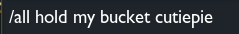

<div align="center">
  
</div>

###


###


###

<h1 align="center">Be Nice</h1>

###

<h3 align="left">Toxic? Honor level 0? Say no more</h3>

###

<p align="left">A python script to replace naughty words.

Dedicated to all the top laners out there.</p>

###

<h3 align="left">🛠 Installation</h3>
<p>1. clone the repo</p>

```
git clone https://github.com/m-kudahl/BeNice
```

<p>2. run the script</p>

```
python BeNice.py
```

<p>3. Be nice</p>

###


###


###
